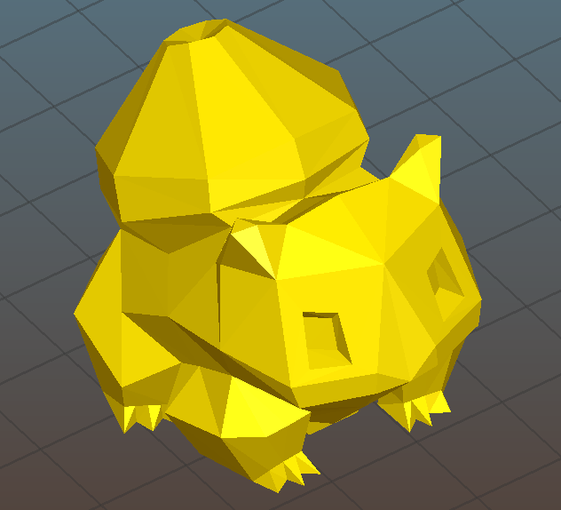
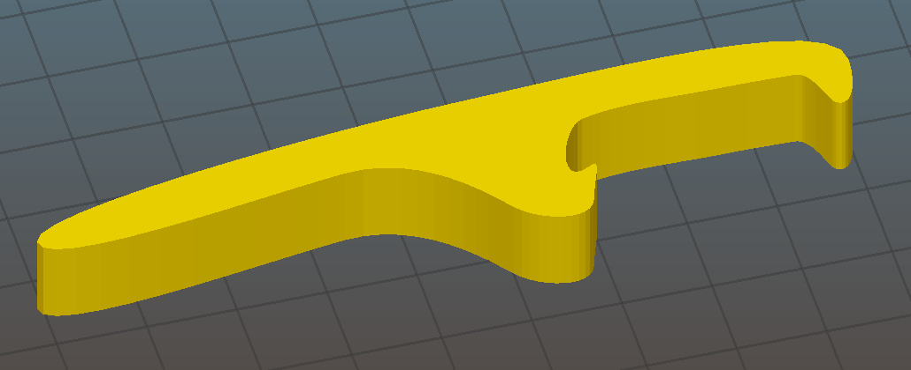
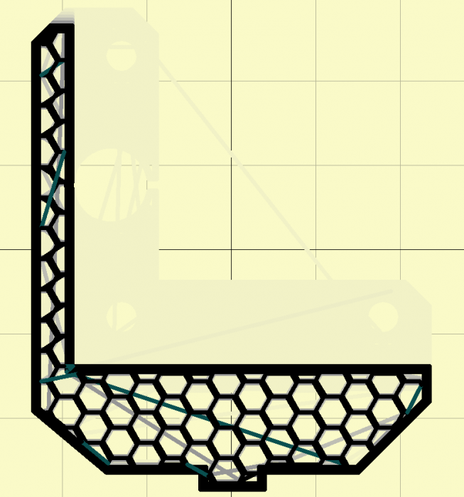

# Zadání cvičení na Slicing

Vaším dnešním úkolem bude naslicovat několik modelů v aplikaci Slic3r.
Abyste ale nezačínali s prázdnou, máme pro vás jako config bundle,
který si importujte do Slic3ru pomocí volby *Load Config Bundle*.

  * [slic3r_config_bundle.ini](https://github.com/3DprintFIT/BI-3DT/blob/master/configs/printing/slic3r_config_bundle.ini)

**Repozitář vytvořte na odkazu https://classroom.github.com/a/xq8iUxW9**.  
Do vašeho vytvořeného repozitáře odevzdáte soubory `bulbasaur.gcode`, 
`vader_cup_v03.gcode`, `bottle_opener.gcode`,
`cube.gcode`, `z_bottom.gcode` a `koch_snowflake.gcode`.
Doporučujeme si jednotlivé configurace Slic3eru ukládat.

## Hodnocení

- Naslicování všech šesti modelů (max. 3 body)
- Úloha nesplňuje zadání (0 bodů)

**Musíte použít Slic3r 1.3.0.** Nepoužívejte starší verzi Slic3ru
ani různé další varianty Slic3ru (Prusa Edition apod.).

## Rady

Tiskárnu mějte nastavenou RebeliX a filament ABS ESUN 1.75mm z config bundlu.
V tisku vycházejte z profilu Normal.
Po jednotlivých vygenerováních gcodu prozkoumejte výstup jednotlivých nastavení
v panelu *Preview* (dole ve Slic3ru).

## Modely

Před každou dílčí úlohou se **vraťte na výchozí konfiguraci**, opětovné *Load Config Bundle*, nebude fungovat tak jak očekáváte, je potřeba buď Slic3r zavřít a znovu otevřít, nebo uložit aktualní změny v změněné konfiguraci pomocí ikony diskety jako nový konfig. A poté používat ten originální, pro další úlohu.

### Bulbasaur

První z modelů je [bulbasaur.stl](bulbasaur.stl)
  (CC BY-NC-SA 3.0 [FLOWALISTIK](https://www.thingiverse.com/thing:327753)) s parametry

  * 5 perimetrů vertikálního shellu, 4 plné dolní vrstvy a 3 horní
  * Rychlost tisku perimetrů je 45 mm/s
  * Raft o 3 vrstvách
  * Infill typu Honeycomb s hustotou 15 %
  * Teplota Bedu je při první vrstvě 79°C
  

### DarthHolder

Druhý je držák na tužky Darth Vadera – [vader_cup_v03.stl](vader_cup_v03.stl)
  (CC BY-NC 3.0 [tmasantos](https://www.thingiverse.com/thing:1396307))
  * Výška jedné vrstvy je 0.35 mm, ale první vrstva je 0.36 mm
  * Rychlost tisku infillu je 45 mm/s, perimetry tiskneme s rychlostí 40 mm/s
  * Chceme nechat vygenerovat support
  * Perimetry nám stačí jen dva
  * Infill 10% a pattern "Rectilinear"
  * Minimum Loops u skirtu změníme na 3
  * Teplota extruderu na první vrstvu je 228°C a na ostatní 232°C
  

### Bottle opener

Nechcete pořád tisknout jen figurky, ale také něco praktického
a to otvírák na pivo – [bottle_opener](bottle_opener.stl) 
  (CC BY-SA 3.0 [leemes](https://www.thingiverse.com/thing:132632))
  * 30% infill se vzorem 3D Honeycombu
  * 3mm (exterior) brim
  * Infill se tiskne s rychlostí 40 mm/s
  * Zpomalte tisk, pokud je doba výtisku jedné vrstvy menší než 15 s
    * (hint: je to proto, aby **plast** měl čas **vychladnout**)
  * Větráček bude permanentně zaplý s minimální rychlostí 10 %
  * Retrakce o 2 mm, když se přejíždí prázdným místem
    * (hint: nastavení retrakce je specifické pro **extruder**)
  

  
  
Teď, když už máte prozkoušené úlohy s přesnými parametry,
tak si vyzkoušíte i varianty bez nich,
které by se vám v životě 3D tiskaře mohly hodit.

### Kostičky

Kamarád chce vytisknout devět kostiček. Všechny s tenkou stěnou,
infill ten co má na sebe kolmé čáry, hustota 10 %,
výplň rovnoběžná s hranami kostky. Jeden perimetr a po jedné stěně nahoře i dole.
Vy osobně se bojíte, aby vám kostičky nepopraskaly kvůli průvanu v místnosti,
takže kolem nich chcete vystavět ochranou bariéru.
Model jedné kostičky kamarád zvládnul vytvořit.

Kostičkami je zakázáno otáčet, protože kamarád má iracionální strach z kosočtverců.

  * Model: [cube.stl](cube.stl)

### Náhradní díl k tiskárně

Na vaší 3D tiskárně RebeliX napraskl díl držící pravý motor.
Máte k dispozici pouze STL, kde jsou oba držáky motorů vedle sebe,
a chcete vytisknout pouze jeden. Měl by mít pevnost úměrnou užití, 
ale potřebujte výtisk co nejrychleji, abyste snížili riziko,
že díl praskne úplně a vy si už nic nevytisknete. Abyste ušetřili čas,
nastavte výšku vrstvy maximální možnou tak, aby to vaše tiskárna RebeliX
zvládla vytisknout bez problému.

  * Model: [z_bottom.stl](z_bottom.stl)

Tip: Při výplni honeycomb můžete k dostatečné pevnosti dílu nastavit 20% výplň,
kvůli vnější pevnosti ale nastavte 3 perimetry.
Tiskárna RebeliX má průměr trysky 0,35 mm.

### Fraktálová váza

Předvádíte 3D tisk na konferenci okrasných indoor zahradníků se zálibou v matematice
a rozhodli jste se vytisknout vázu definovanou fraktálem.
Protože STL soubor je však vytvořen jako plný blok (pro představu si ho prohlédněte),
musíte vhodným nastavením docílit toho, aby se váza vytiskla dutá, s dírou nahoře.
(Neupravujte mesh v editoru, výsledku dosáhnete pouze správným nastavením Slic3ru!)
Protože chcete tisknout rychle, ale vodotěsně,
rozhodli jste se použít metodu tisku do spirály.

  * Model: [koch_snowflake.stl](koch_snowflake.stl)

